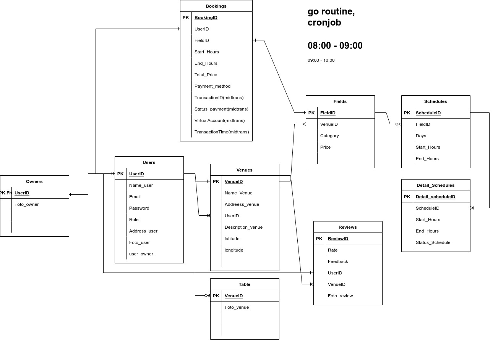

<!-- PROJECT LOGO -->
 

<!--  mengarah ke repo  -->
  

  <h3 align="center">SEGORO Apps</h3>

  

    Capstone Project Alterra Academy Backend Batch 11
     
    <a href="https://app.swaggerhub.com/apis-docs/raorafarhan/segoro/1.0.0"><strong>Explore the docs Open API »</strong></a>
     
  

<!-- ABOUT THE PROJECT -->
## About The Project

<!-- [![Product Name Screen Shot][product-screenshot]](https://example.com) -->

SEGORO adalah sebuah aplikasi berbasis online yang digunakan untuk menyewa atau booking Gor secara online, berikut fitur-fitur yanga tersedia di SEGORO Apps  :

      <ul>
        <li><h5>Users</h5></li>
        
Users dapat melakukan Create, Read, Update, Delete (CRUD) pada data user.
         Users yang telah melakukan registrasi (create) dapat melakukan login.
        User juga dapat mendaftar sebagai pemilik Gor

        <li><h5>Venue/Gor</h5></a></li>
        
Users yang sudah upgrade akun menjadi owner dapat melakukan Create, Read, Update, Delete (CRUD) pada data Venue/Gor.
         Fitur Update dan Delete hanya dapat dilakukan pada Gor miliknya sendiri.
         User dapat melihat semua data Gor termasuk Gor yang dimilikinya sendiri.

        <li><h5>Field/Lapangan</h5></a></li>
        
Users dapat melakukan Create, Read, Update, Delete (CRUD) pada data Field.
         Users dapat melihat-lihat category field yang ada di dalam venue.
         Users dapat melihat semua data Field termasuk Field yang dimilikinya sendiri.

        <li><h5>Booking</h5></a></li>
        
Users dapat melakukan booking Gor.
         Users dapat mengecek ketersediaan Gor dan lapangan.
         Users dapat melihat data booking.

        <li><h5>Reviews</h5></a></li>
        
Users dapat melakukan review dan memberi rating kepada Gor.
         Users dapat mengupload foto pada review.
         Users dapat melihat data reviews.

      </ul>

(<a href="#top">back to top</a>)

### Built With

<!-- * [Golang](https://golang.org/)
* [Echo Framework](https://echo.labstack.com/)
* [MySQL](https://www.mysql.com/)
* [Gorm](https://gorm.io/)
* [JWT](https://echo.labstack.com/cookbook/jwt)
* [Assert](https://pkg.go.dev/github.com/stretchr/testify/assert)
* [VS Code](https://code.visualstudio.com/) -->
&nbsp;
&nbsp;
&nbsp;

(<a href="#top">back to top</a>)

<!-- ERD -->
## ERD

<!-- CONTACT -->
## Contact

Project Link : [https://github.com/ALTA-FE8-G2CAPS](https://github.com/ALTA-FE8-G2CAPS) 

<!-- :heart: -->
<!-- CONTRIBUTOR -->
### Built With

* [Golang](https://golang.org/)
* [Echo Framework](https://echo.labstack.com/)
* [MySQL](https://www.mysql.com/)
* [Gorm](https://gorm.io/)
* [JWT](https://echo.labstack.com/cookbook/jwt)
* [VS Code](https://code.visualstudio.com/)

Contributor :
 

 

Mentor :
 

(<a href="#top">back to top</a>)

<h3>

:copyright: 2022 | Alterra Academy BE11 :fire:

</h3>